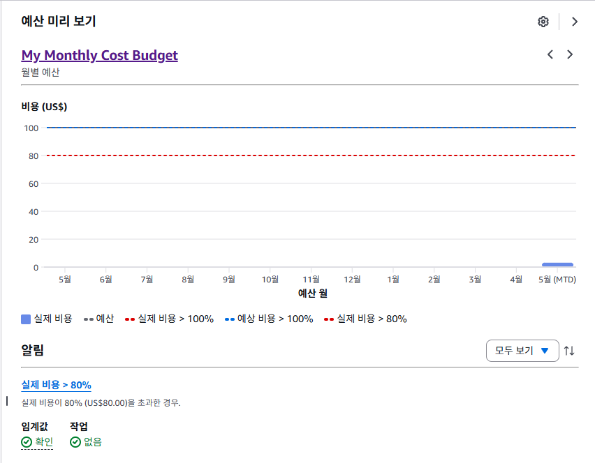
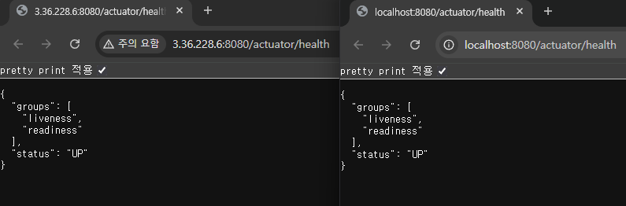
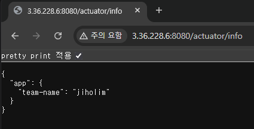
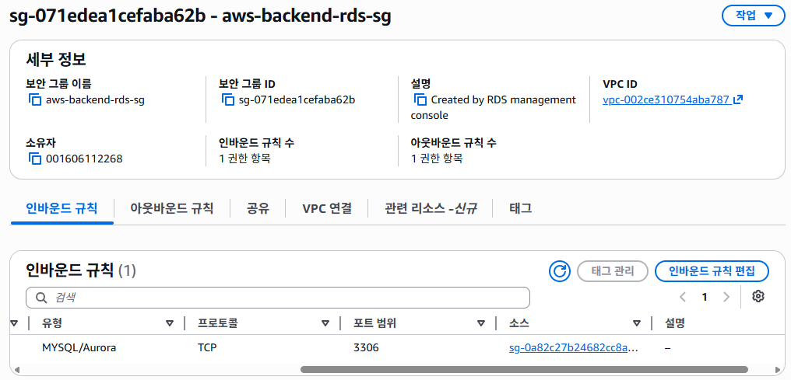
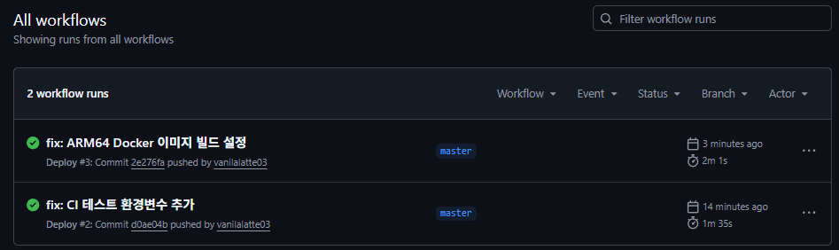
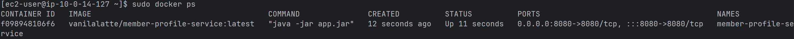
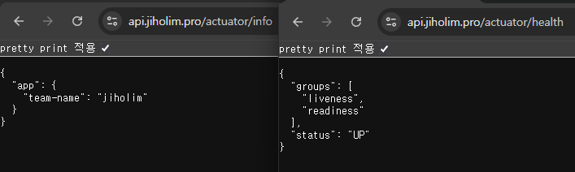
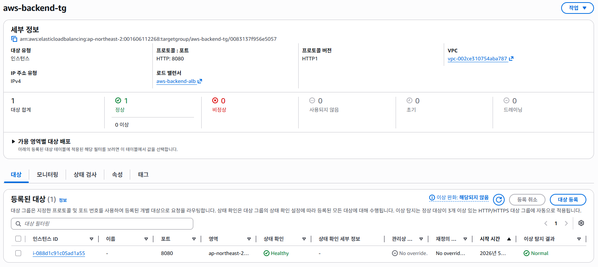
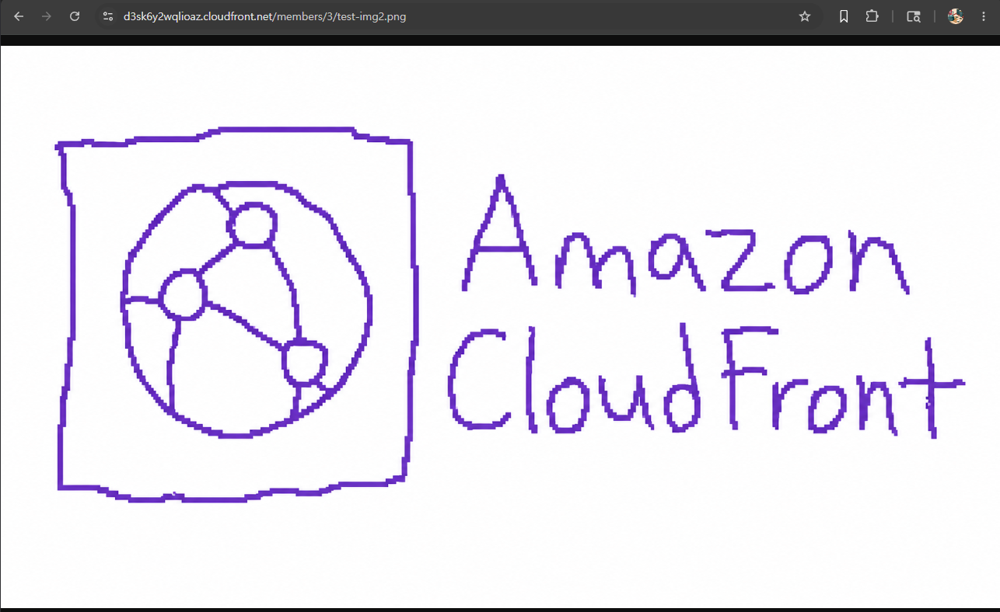

# AWS 기반 팀원 프로필 관리 서비스

## 프로젝트 소개

팀원 프로필 정보를 등록하고 조회할 수 있는 Spring Boot 기반 백엔드 서비스입니다. 회원 기본 정보는 RDS MySQL에 저장하고, 프로필 이미지는 S3에 업로드한 뒤 Presigned URL 또는 CloudFront를 통해 안전하게 조회할 수 있도록 구성했습니다.

이 프로젝트는 단일 서버 배포에서 시작해 RDS, S3, IAM Role, Docker, GitHub Actions, ALB, Auto Scaling Group, Route 53, ACM, CloudFront까지 단계적으로 AWS 인프라를 확장한 실습 프로젝트입니다.

## 주요 기능

- 회원 생성 및 단건 조회
- 회원 프로필 이미지 S3 업로드
- 7일 만료 Presigned URL 발급
- Actuator 기반 Health Check와 Info 조회
- Docker 이미지 기반 배포 자동화
- ALB, ASG, HTTPS 도메인, CloudFront CDN 구성

## API 요약

- 로컬 Base URL: `http://localhost:8080`
- 운영 Base URL: `https://api.jiholim.pro`
- 상세 API 명세: [`docs/API.md`](dosc/API.md)

| Method | Path | 설명 |
| --- | --- | --- |
| `POST` | `/api/members` | 회원 생성 |
| `GET` | `/api/members/{id}` | 회원 단건 조회 |
| `POST` | `/api/members/{id}/profile-image` | 프로필 이미지 업로드 |
| `GET` | `/api/members/{id}/profile-image` | 프로필 이미지 Presigned URL 발급 |
| `GET` | `/actuator/health` | 애플리케이션 상태 확인 |
| `GET` | `/actuator/info` | 애플리케이션 정보 조회 |

## 기술 스택

- Java 17
- Spring Boot 4
- Spring Data JPA
- H2, MySQL RDS
- AWS S3, Parameter Store, IAM Role
- Docker, GitHub Actions
- ALB, Auto Scaling Group, Route 53, ACM, CloudFront

## LV0. AWS Budgets 설정

## LV1. 네트워크 구축 및 핵심 기능 배포

### EC2 정보

- EC2 Public IP: `3.36.228.6`
- Health Check URL: `http://3.36.228.6:8080/actuator/health`

### 배포 검증

- EC2에 Spring Boot 애플리케이션을 배포하고 실행했습니다.
- 로컬 환경과 EC2 환경에서 Actuator Health Check 응답이 `UP` 상태임을 확인했습니다.

## LV2. DB 분리 및 보안 연결

### Actuator Info 엔드포인트

- Info URL: `http://3.36.228.6:8080/actuator/info`
- Spring Boot 애플리케이션을 `prod` 프로필로 실행하고, AWS Parameter Store에 저장한 `team-name` 값이 `/actuator/info` 응답에 출력되는 것을 확인했습니다.

### RDS 보안 그룹

- RDS MySQL은 EC2에서만 접근할 수 있도록 보안 그룹 인바운드 규칙을 설정했습니다.
- RDS 보안 그룹의 `MYSQL/Aurora` 3306 포트 Source에는 IP 주소가 아닌 EC2 보안 그룹 ID를 등록했습니다.
- EC2 보안 그룹 ID: `sg-0a82c27b24682cc8a`

## LV3. 프로필 사진 기능 추가와 권한 관리

### S3 접근 방식

프로필 이미지는 퍼블릭 액세스가 차단된 S3 버킷에 저장했습니다.  
EC2에는 S3 접근 권한이 있는 IAM Role을 연결했고, 애플리케이션은 Access Key 없이 IAM Role 기반 자격 증명으로 S3에 접근합니다.

### Presigned URL 검증

`GET /api/members/2/profile-image` 요청 시 7일 만료 Presigned URL을 발급하도록 구현했습니다.

- Presigned URL 발급 API: `http://3.36.228.6:8080/api/members/2/profile-image`
- 만료 시간: `2026-05-24T13:49:56.786746850Z`
- 만료 설정: 7일

IAM Role 기반 자격 증명으로 Presigned URL을 생성했으며, 아래 캡처에서 발급된 URL을 통해 S3 비공개 객체에 접근 성공한 것을 확인했습니다.

## LV4. Docker & CI/CD 파이프라인 구축

### Github Actions 배포 성공

- `master` 브랜치에 push하면 Github Actions에서 Gradle Build/Test를 수행합니다.
- 빌드된 Docker 이미지를 Docker Hub(`vanilalatte/member-profile-service:latest`)에 push합니다.
- 이후 EC2에 SSH로 접속하여 최신 이미지를 pull 받고 기존 컨테이너를 교체 실행합니다.

### EC2 Docker 컨테이너 실행 확인

- EC2에 접속한 뒤 `sudo docker ps` 명령어로 실행 중인 컨테이너를 확인했습니다.
- `member-profile-service` 컨테이너가 `vanilalatte/member-profile-service:latest` 이미지로 실행 중이며, `8080` 포트가 컨테이너에 매핑되어 있습니다.

## LV5. 고가용성 아키텍처와 보안 도메인 연결

### HTTPS 도메인 적용

- HTTPS 적용 도메인 URL: `https://api.jiholim.pro`
- Health Check URL: `https://api.jiholim.pro/actuator/health`
- Actuator Info URL: `https://api.jiholim.pro/actuator/info`

Route 53에서 `api.jiholim.pro` A 레코드를 ALB(`aws-backend-alb`)에 Alias로 연결하고, ACM에서 발급한 인증서를 ALB HTTPS 443 리스너에 적용했습니다.

### Target Group 상태

- Target Group: `aws-backend-tg`
- 연결된 ALB: `aws-backend-alb`
- 대상 포트: `8080`
- 상태: Auto Scaling Group으로 생성된 EC2 인스턴스가 Target Group에 등록되었고 `Healthy` 상태임을 확인했습니다.

## LV6. 글로벌 성능 최적화 (CloudFront CDN)

### CloudFront CDN 적용

S3 버킷(`member-profile-images-jh`)을 CloudFront 배포의 Origin으로 연결하고, S3에 저장된 프로필 이미지를 CloudFront 도메인을 통해 조회하도록 구성했습니다.

- CloudFront 배포 도메인: `https://d3sk6y2wqlioaz.cloudfront.net`
- CloudFront 이미지 URL: `https://d3sk6y2wqlioaz.cloudfront.net/members/3/test-img2.png`

위 URL로 접속했을 때 S3에 업로드한 프로필 이미지가 CloudFront를 통해 정상적으로 로딩되는 것을 확인했습니다.

